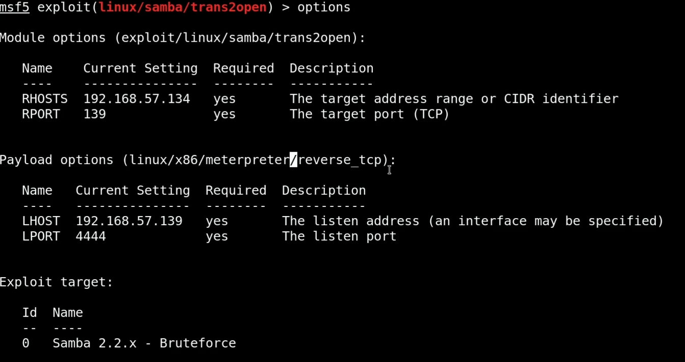

# Gaining Root With Metasploit

1. Find an exploit using SearchSploit.
2. Search it in msfconsole like this: "search \[exploit name]".
3. Select the module that matches to your target machine (using info you got from recon & scanning & enum).
4. Set it to be the payload you want to deliver like this: "use \[exploit index number]".
5. Type in "options" to see what options you have for the module.
6. Set your RHOST (Remote Host - target machine).
7. OPTIONAL: check for the target you want to attack using "show targets" and select a different one if you want to.
8. If everything is good, type in "exploit" to deliver the payload.

***

## Diagnosis:

* If the payload doesn't deliver correctly, type in "options" again into msfconsole.
* Metasploit will display "Payload Options" to you because it knows your payload didn't work.
* Try switching from an Unstaged and Staged payload (you'll know what it is because Metasploit will tell you, as shown below) or vice versa.

<figure><figcaption></figcaption></figure>

-> Here, the payload was staged

***

## Choosing a Different Payload (e.g., from Staged):

1. Find available payloads:


```
msf exploit(...) > set payload linux/ + [TAB KEY]
```


2. Choose an Unstaged payload:

```
msf exploit(...) > set payload linux/x86/[exploit name after "set"]
```

Example:

<figure><figcaption></figcaption></figure>

<figure><figcaption></figcaption></figure>

3. Double check everything's okay - type in "options".
4. Run the exploit again.
